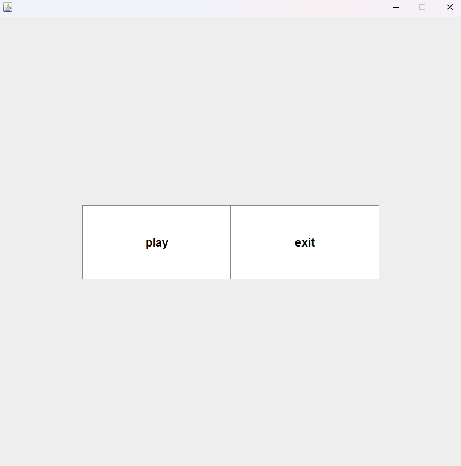
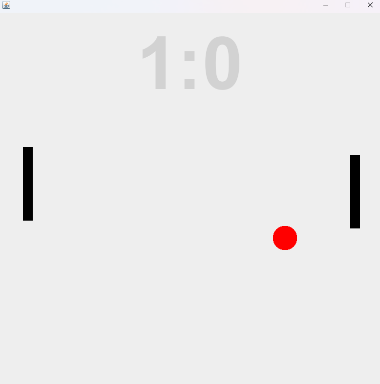

# proj1_pong
My first completely selfmade GUI game
As I want to become a standalone, selftaught gamedeveloper I finally decided to screw AI generated code and work my skills up from the ground again. I've spent a few weeks
with mostly terminal based games (numberhunter>rockPaperScissor>combat_game>merchant_simulator>inventory_system>combat_arena>text_adventure).
All these games forced me to learn a lot of concepts like OOP, Loops, Polymorphism, Interface, State machines, Composition etc. 
As this is my first GUI game made with 0 Ai I decided to start logging my progress and development!

